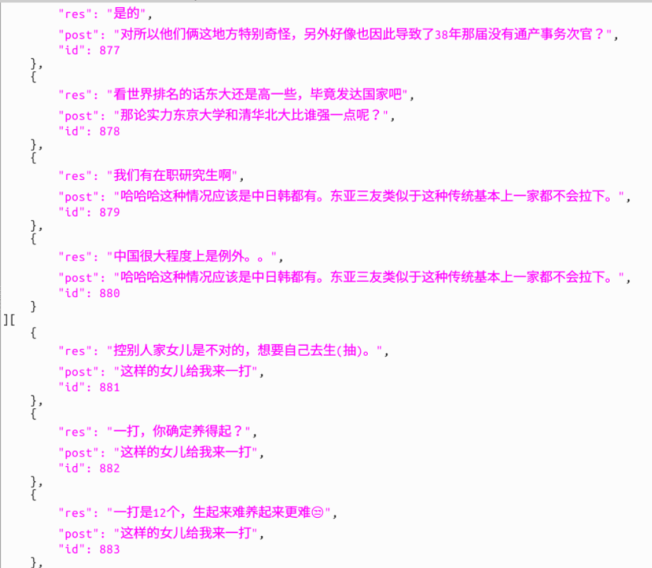

### Function

- Crawl comments under zhihu answer, and form one round conversation , the answers are from collution"[赞同超过1000的回答](**https://www.zhihu.com/collection/19928423**)
- Assign the emotion to each sentence in QA pairs using NLPCC emotion labeled data of weibo 

### Sample Data

the data is store in the json format. it is a dictionary list, contains three field: "post" ,"res" for response, and the conversation id.

### Requirement

- zhihu_outh
- torch
- pandas
- jieba
- numpy

### Usage

- fill in you zhihu account in login.py and generate token.pkl.
- run crawler.py to generate the conversation and run preprocessing.py to clean and format data.
- download NLPCC 2017 weibo data from and place it in ./data  folder.
- run Classify/cnn_pytorch.py to generate the emtion label for the sentences.